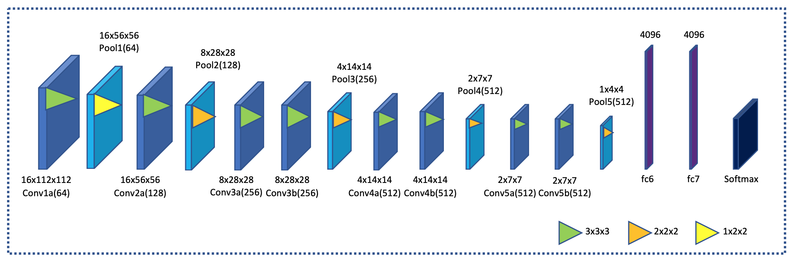

# 3D CNN

Inspired by the performance of [Ullah’s network](https://www.semanticscholar.org/paper/Violence-Detection-Using-Spatiotemporal-Features-3D-Ullah-Ullah/953a96b6cf39d9acab182ea6345d0202210ebcc0), we decided to use his 3D CNN network to determine the performance of the newly created GTA-V dataset. The network architecture is shown in figure 1.

**Figure 1:** 3D CNN network architecture

The file **"ViolenceDetectionUsingGTAV/3D CNN/Generator_NpSequences.ipynb"** contains the code to save the frame sequences in the right input format (numpy files). In this file, the locations of the sequences were extracted from the text files generated in the data pre-processing. Batch sequences are created and stored in a numpy file.

Next, the model is created and evaluated in the file **"ViolenceDetectionUsingGTAV/3D CNN/CreateC3DNetwork_And_TrainingTesting.ipynb"**. Each convolutional layer has 3x3x3 kernel size with stride 1x1x1. All pooling layers have 2x2x2 kernel size with stride 2x2x2 except for the first pooling layer with a kernel size of 1x2x2 and stride 1x2x2. The number of filters for each convolutional layer differs per layer. The first and second convolutional layers have 64 filters, the third and fourth convolutional layers have 128 filters, the fifth and second convolutional layers have 256 filters and the other convolutional layers have 512 filters. Stochastic gradient descent with a mini-batch size of 16 was used to update the parameters, with a learning rate of 0.001. Dropout was used in the fully connected layers with a rate of 0.5. Each fully connected layer has 4096 output units. The Softmax layer contains two outputs because there were two classes in the dataset: fight and non-fight scenarios. The model was trained over 40 epochs.

After training the model, the best model and weights are stored in the directory **"ViolenceDetectionUsingGTAV/3D CNN/weights"**. 

Some datasets are too large to be loaded in the AWS GPU server at one time. Therefore, it was decided to split the datasets into several parts. This is done by the code in the file ** **"ViolenceDetectionUsingGTAV/3D CNN/CreateSubdata.ipynb"**.

## System
We trained and tested the 3D CNN model using a Graphics Processing Unit (GPU). During compiling the model, it turned out that our computers did not have enough CPU and GPU. Therefore, we used a virtual machine on Amazon Web Services (AWS). We employed an EC2 P2.xlarge instance on the AWS server, which comes with an Nvidia k80 GPU and a 61 GB RAM.

